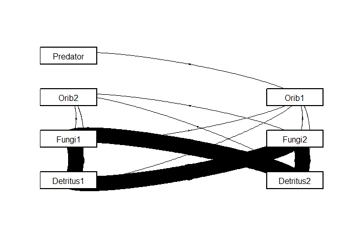

<!-- README.md is generated from README.Rmd. Please edit that file -->

# soilfoodwebs

<!-- badges: start -->
<!-- badges: end -->

The purpose of the `soilfoodwebs` package is to help analyze and
simulate soil food webs. The following five functions are the core of
the package:

1.  Calculate the fluxes through a food web given biomass, parameters,
    and food web structure.
2.  Calculate the direct and indirect contribution of each trophic
    species (i.e., node) to carbon and nitrogen mineralization.
3.  Calculate food web stability and `smin`.
4.  Simulate the food web away from equilibrium.
5.  Conduct a detritus decomposition simulation and calculate the
    decomposition constant.

The package also can complete the following tasks using functions built
to work with the communities that are input:

1.  Modify the fluxes to balance carbon and nitrogen demands.
2.  Modify the structure of the food web.

## Installation

You can install the released version of soilfoodwebs from
[GitHub](https://github.com/) with:

``` r
# Install devtools if not available:
if (!require("devtools")) install.packages("devtools")

# Install soilfoodwebs
devtools::install_github("robertwbuchkowski/soilfoodwebs")
```

## Example

The core of the `soilfoodwebs` package allows you to calculate the
fluxes of carbon and nitrogen through a food web at equilibrium using
basic properties about each trophic species or node.

For example, here is a plot of the carbon flow through the introductory
community after corrections are made to balance nitrogen demand.

``` r
library(soilfoodwebs)
intro_comm_temp = corrstoich(intro_comm)
ana1 <- comana(intro_comm_temp, mkplot = T, whattoplot = "web")
```



Here are the rates of carbon and nitrogen mineralization predicted for
each species.

``` r
# Carbon mineralization:
ana1$Cmin
#>   Predator      Orib2      Orib1     Fungi1     Fungi2  Detritus1  Detritus2 
#>     2.8704     9.5250    40.5350 20081.9528 19970.4067     0.0000     0.0000

# Nitrogen mineralization:
rowSums(ana1$Nmin)
#>      Predator         Orib2         Orib1        Fungi1        Fungi2 
#>  5.510821e-01  5.941428e-17 -3.174544e-16  1.195354e+02  4.754859e+02 
#>     Detritus1     Detritus2 
#>  0.000000e+00  0.000000e+00
```
